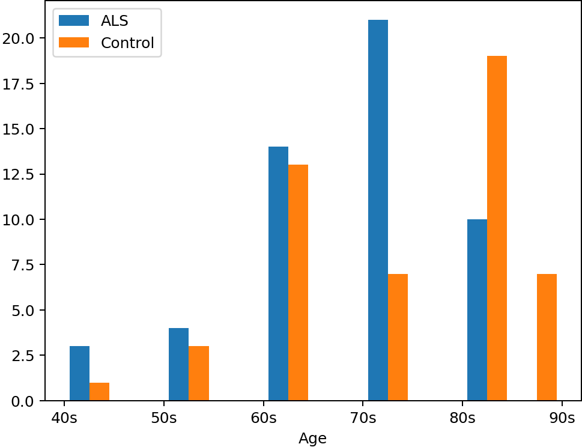
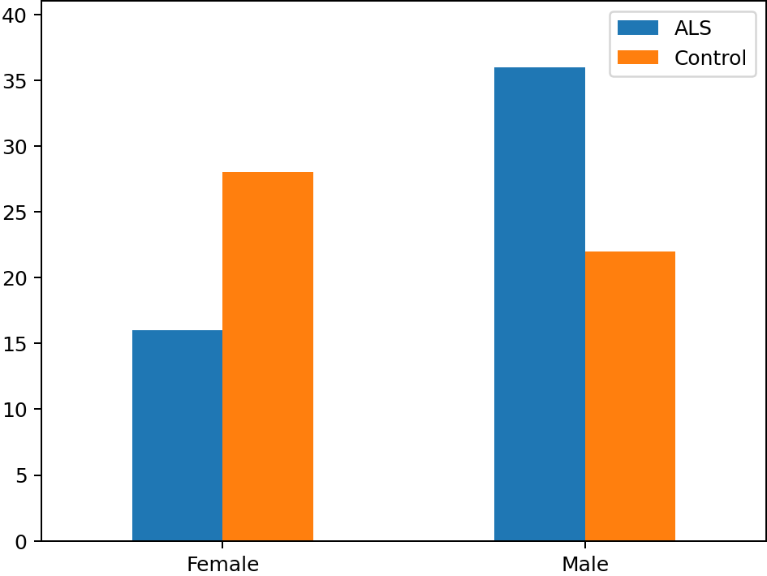
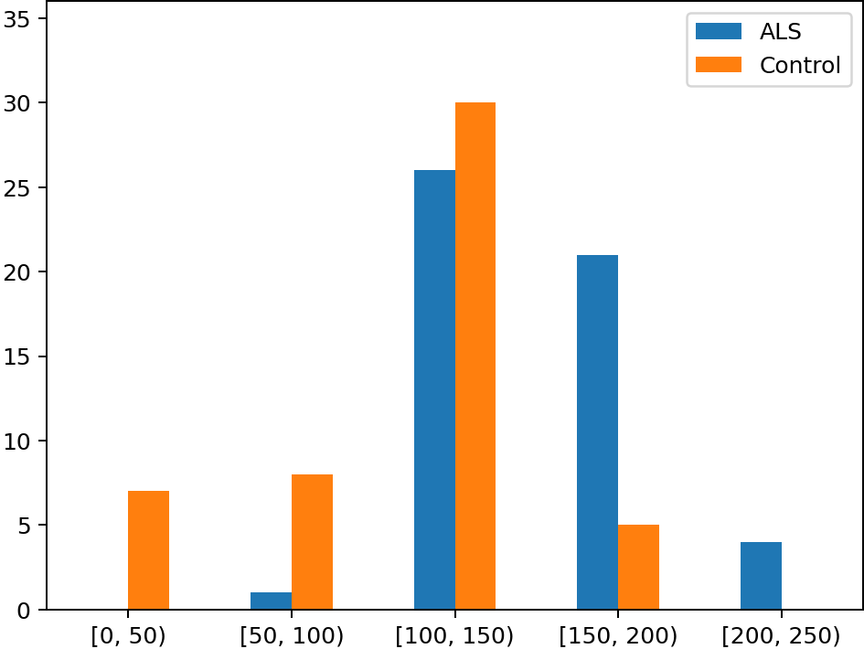
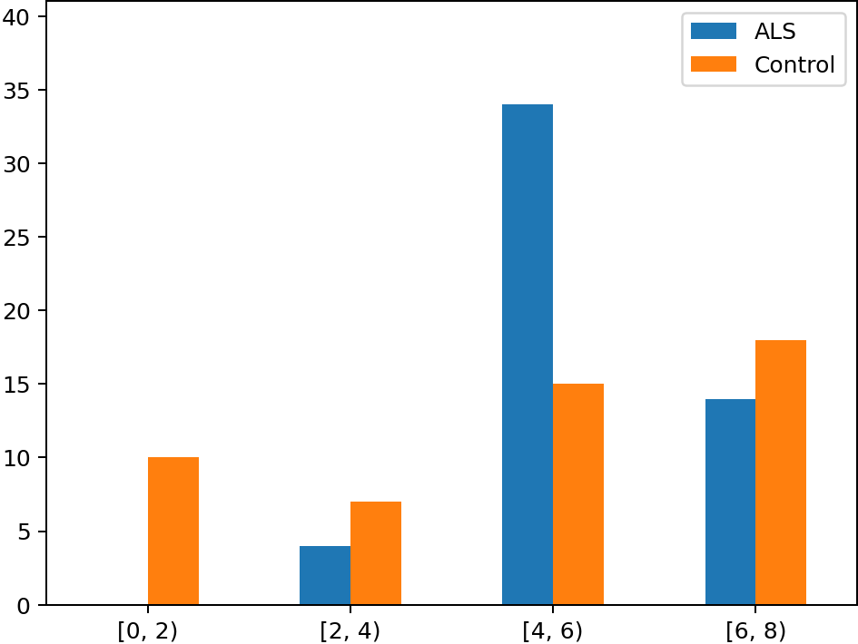
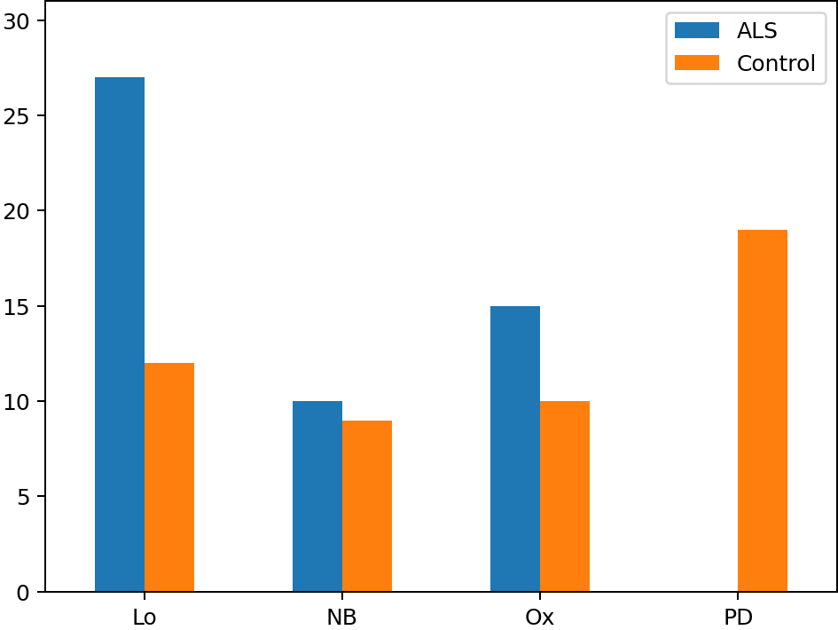
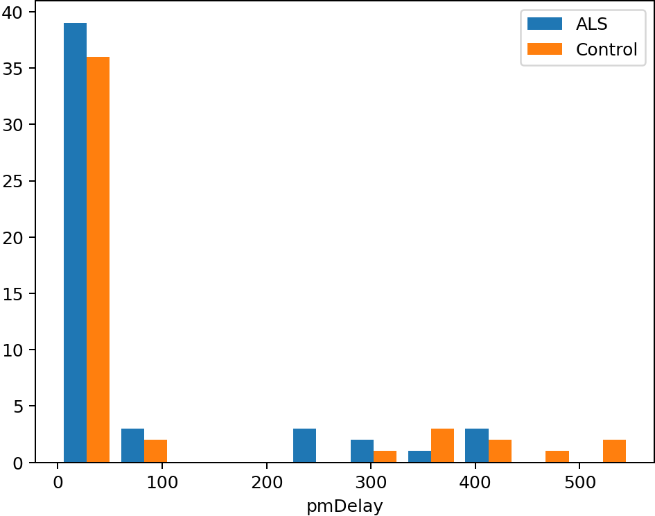
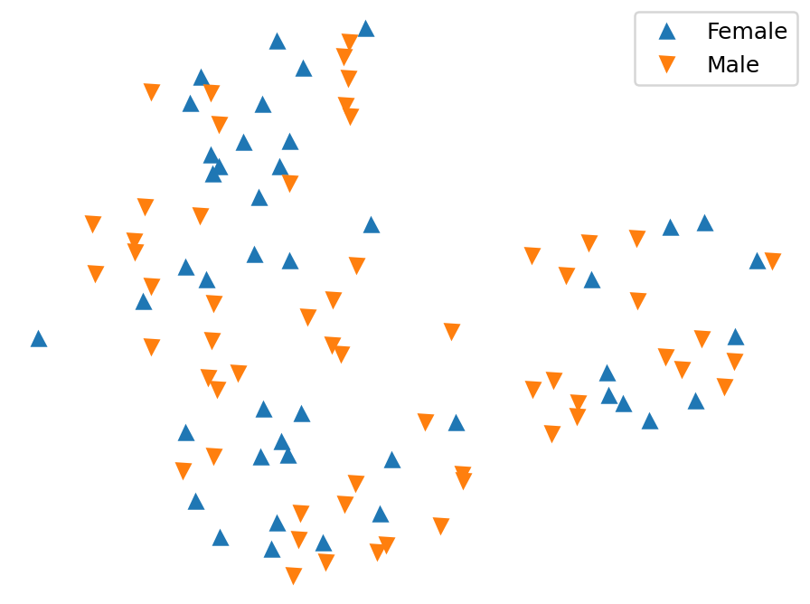

Exploratory analysis on the ALS dataset 
[[1]](../../../data/20201128-FGCZ).

To compute the t-SNE embeddings,
the gene counts are first normalized to sum=1 for each sample,
then subset to the marker genes
from [here](https://github.com/sta426hs2020/material/blob/8c57e3b/week13-07dec2020/workflow.Rmd#L152),
see [a_exploratory.py](a_exploratory.py).

This file was generated by [c_readme.py](c_readme.py) (UTC-20201221-214404).

### Histograms by condition

#### Age

#### Gender

#### LibConc

#### RIN

#### Source

#### pmDelay

### T-SNE embeddings

#### Age

#### Condition

#### Gender

#### Source

