This file was generated by [c_readme.py](c_readme.py) (UTC-20201221-170640).

For each cell from 
Darmanis et al [[1]](../../../data/20201206-RefDatasets/2015-Darmanis),
as quoted in the title:

- The figure on the left shows the distribution
of the cosine similarity measure against
cells from Allen Brain M1 [[2]](../../../data/20201206-RefDatasets/2019-AllenBrain-M1).
The similarities above 95% quantile have been removed.

- The figure on the right shows the association
of the cell with the cells from Allen Brain M1
on the t-SNE plot by the same similarity measure.

GSM1657885 (astrocytes)

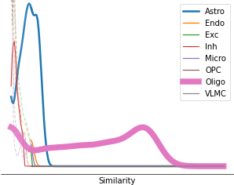
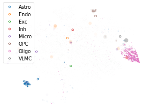

GSM1657932 (astrocytes)

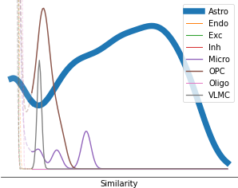
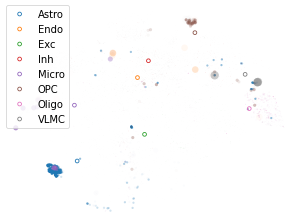

GSM1657938 (astrocytes)

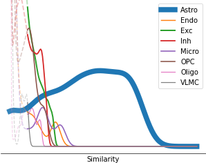
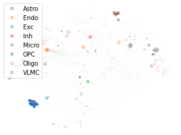

GSM1657965 (astrocytes)

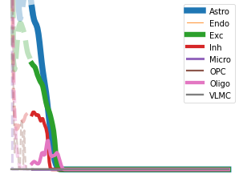
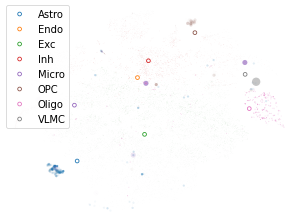

GSM1657969 (astrocytes)

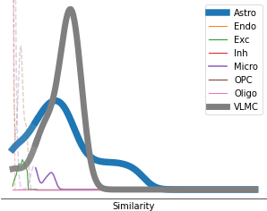
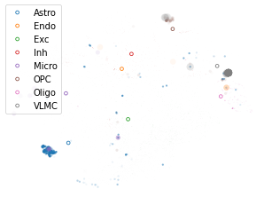

GSM1657975 (astrocytes)

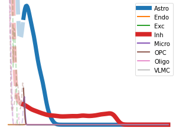
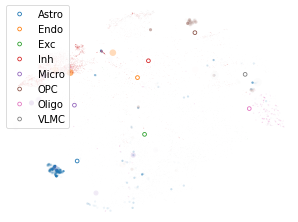

GSM1657979 (astrocytes)

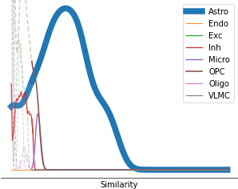
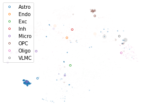

GSM1657981 (astrocytes)

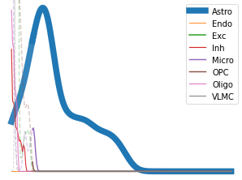
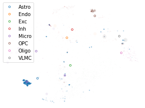

GSM1657992 (astrocytes)

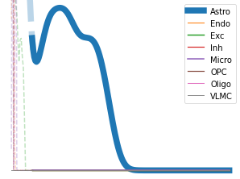
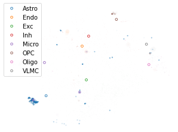

GSM1657998 (astrocytes)

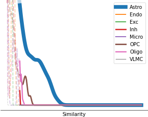
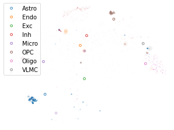

GSM1658000 (astrocytes)

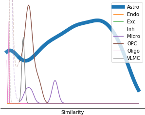

GSM1658006 (astrocytes)

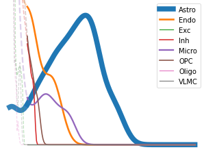
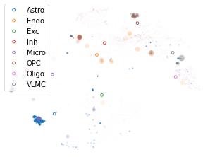

GSM1658007 (astrocytes)

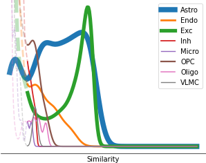
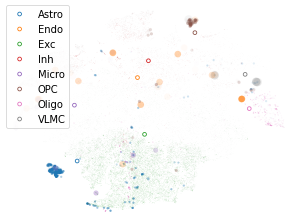

GSM1658010 (astrocytes)

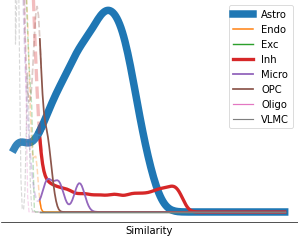
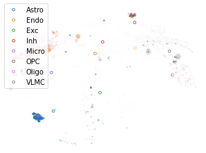

GSM1658016 (astrocytes)

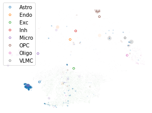

GSM1658017 (astrocytes)

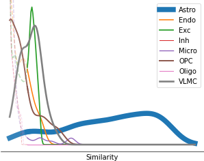
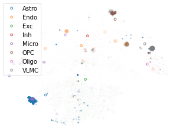

GSM1658020 (astrocytes)

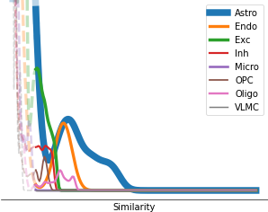
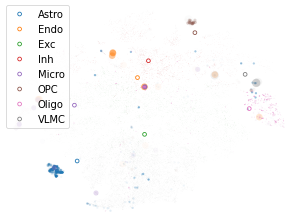

GSM1658021 (astrocytes)

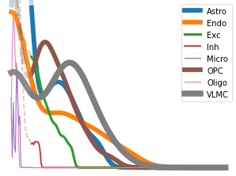
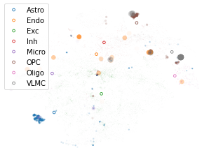

GSM1658026 (astrocytes)

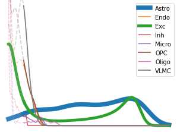

GSM1658027 (astrocytes)

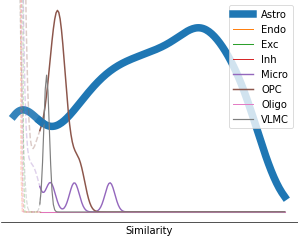
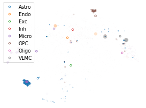

GSM1658029 (astrocytes)

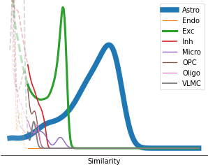

GSM1658031 (astrocytes)

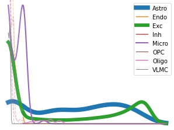
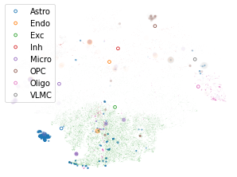

GSM1658043 (astrocytes)

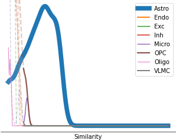
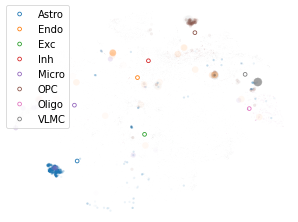

GSM1658045 (astrocytes)

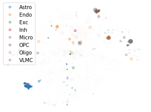

GSM1658048 (astrocytes)

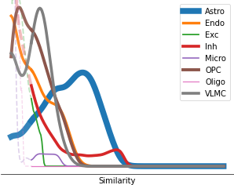

GSM1658049 (astrocytes)

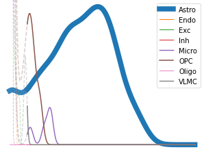
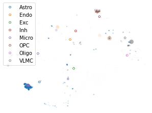

GSM1658050 (astrocytes)

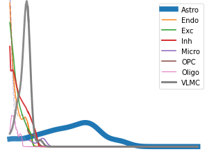
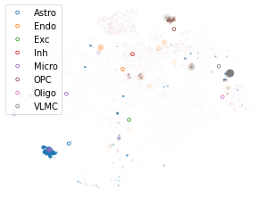

GSM1658051 (astrocytes)

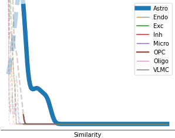
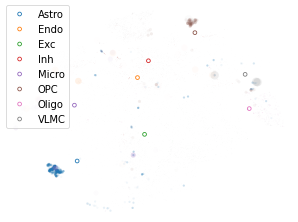

GSM1658053 (astrocytes)

GSM1658054 (astrocytes)

GSM1658055 (astrocytes)

GSM1658056 (astrocytes)

GSM1658059 (astrocytes)

GSM1658060 (astrocytes)

GSM1658061 (astrocytes)

GSM1658062 (astrocytes)

GSM1658064 (astrocytes)

GSM1658065 (astrocytes)

GSM1658066 (astrocytes)

GSM1658067 (astrocytes)

GSM1658068 (astrocytes)

GSM1658069 (astrocytes)

GSM1658071 (astrocytes)

GSM1658072 (astrocytes)

GSM1658073 (astrocytes)

GSM1658078 (astrocytes)

GSM1658079 (astrocytes)

GSM1658081 (astrocytes)

GSM1658082 (astrocytes)

GSM1658142 (astrocytes)

GSM1658168 (astrocytes)

GSM1658174 (astrocytes)

GSM1658184 (astrocytes)

GSM1658185 (astrocytes)

GSM1658186 (astrocytes)

GSM1658187 (astrocytes)

GSM1658190 (astrocytes)

GSM1658191 (astrocytes)

GSM1658193 (astrocytes)

GSM1658199 (astrocytes)

GSM1658201 (astrocytes)

GSM1658202 (astrocytes)

GSM1657972 (endothelial)

GSM1657993 (endothelial)

GSM1657995 (endothelial)

GSM1658004 (endothelial)

GSM1658083 (endothelial)

GSM1658085 (endothelial)

GSM1658086 (endothelial)

GSM1658089 (endothelial)

GSM1658092 (endothelial)

GSM1658094 (endothelial)

GSM1658096 (endothelial)

GSM1658098 (endothelial)

GSM1658099 (endothelial)

GSM1658100 (endothelial)

GSM1658102 (endothelial)

GSM1658109 (endothelial)

GSM1658112 (endothelial)

GSM1658117 (endothelial)

GSM1658122 (endothelial)

GSM1658126 (endothelial)

GSM1658003 (fetal_quiescent)

GSM1658221 (fetal_quiescent)

GSM1658223 (fetal_quiescent)

GSM1658225 (fetal_quiescent)

GSM1658226 (fetal_quiescent)

GSM1658227 (fetal_quiescent)

GSM1658229 (fetal_quiescent)

GSM1658230 (fetal_quiescent)

GSM1658231 (fetal_quiescent)

GSM1658232 (fetal_quiescent)

GSM1658233 (fetal_quiescent)

GSM1658234 (fetal_quiescent)

GSM1658235 (fetal_quiescent)

GSM1658236 (fetal_quiescent)

GSM1658237 (fetal_quiescent)

GSM1658238 (fetal_quiescent)

GSM1658239 (fetal_quiescent)

GSM1658240 (fetal_quiescent)

GSM1658241 (fetal_quiescent)

GSM1658243 (fetal_quiescent)

GSM1658244 (fetal_quiescent)

GSM1658245 (fetal_quiescent)

GSM1658246 (fetal_quiescent)

GSM1658247 (fetal_quiescent)

GSM1658248 (fetal_quiescent)

GSM1658249 (fetal_quiescent)

GSM1658251 (fetal_quiescent)

GSM1658253 (fetal_quiescent)

GSM1658255 (fetal_quiescent)

GSM1658257 (fetal_quiescent)

GSM1658259 (fetal_quiescent)

GSM1658262 (fetal_quiescent)

GSM1658264 (fetal_quiescent)

GSM1658266 (fetal_quiescent)

GSM1658268 (fetal_quiescent)

GSM1658270 (fetal_quiescent)

GSM1658272 (fetal_quiescent)

GSM1658275 (fetal_quiescent)

GSM1658277 (fetal_quiescent)

GSM1658279 (fetal_quiescent)

GSM1658281 (fetal_quiescent)

GSM1658284 (fetal_quiescent)

GSM1658286 (fetal_quiescent)

GSM1658288 (fetal_quiescent)

GSM1658290 (fetal_quiescent)

GSM1658292 (fetal_quiescent)

GSM1658294 (fetal_quiescent)

GSM1658297 (fetal_quiescent)

GSM1658299 (fetal_quiescent)

GSM1658301 (fetal_quiescent)

GSM1658305 (fetal_quiescent)

GSM1658306 (fetal_quiescent)

GSM1658307 (fetal_quiescent)

GSM1658308 (fetal_quiescent)

GSM1658309 (fetal_quiescent)

GSM1658310 (fetal_quiescent)

GSM1658311 (fetal_quiescent)

GSM1658312 (fetal_quiescent)

GSM1658313 (fetal_quiescent)

GSM1658314 (fetal_quiescent)

GSM1658315 (fetal_quiescent)

GSM1658316 (fetal_quiescent)

GSM1658317 (fetal_quiescent)

GSM1658318 (fetal_quiescent)

GSM1658319 (fetal_quiescent)

GSM1658320 (fetal_quiescent)

GSM1658321 (fetal_quiescent)

GSM1658322 (fetal_quiescent)

GSM1658323 (fetal_quiescent)

GSM1658324 (fetal_quiescent)

GSM1658325 (fetal_quiescent)

GSM1658326 (fetal_quiescent)

GSM1658327 (fetal_quiescent)

GSM1658328 (fetal_quiescent)

GSM1658329 (fetal_quiescent)

GSM1658330 (fetal_quiescent)

GSM1658331 (fetal_quiescent)

GSM1658332 (fetal_quiescent)

GSM1658333 (fetal_quiescent)

GSM1658334 (fetal_quiescent)

GSM1658335 (fetal_quiescent)

GSM1658336 (fetal_quiescent)

GSM1658337 (fetal_quiescent)

GSM1658338 (fetal_quiescent)

GSM1658339 (fetal_quiescent)

GSM1658340 (fetal_quiescent)

GSM1658341 (fetal_quiescent)

GSM1658342 (fetal_quiescent)

GSM1658343 (fetal_quiescent)

GSM1658344 (fetal_quiescent)

GSM1658345 (fetal_quiescent)

GSM1658346 (fetal_quiescent)

GSM1658348 (fetal_quiescent)

GSM1658349 (fetal_quiescent)

GSM1658350 (fetal_quiescent)

GSM1658351 (fetal_quiescent)

GSM1658352 (fetal_quiescent)

GSM1658353 (fetal_quiescent)

GSM1658354 (fetal_quiescent)

GSM1658356 (fetal_quiescent)

GSM1658357 (fetal_quiescent)

GSM1658358 (fetal_quiescent)

GSM1658359 (fetal_quiescent)

GSM1658360 (fetal_quiescent)

GSM1658361 (fetal_quiescent)

GSM1658362 (fetal_quiescent)

GSM1658363 (fetal_quiescent)

GSM1658364 (fetal_quiescent)

GSM1658365 (fetal_quiescent)

GSM1658366 (fetal_quiescent)

GSM1658203 (fetal_replicating)

GSM1658204 (fetal_replicating)

GSM1658205 (fetal_replicating)

GSM1658206 (fetal_replicating)

GSM1658207 (fetal_replicating)

GSM1658208 (fetal_replicating)

GSM1658209 (fetal_replicating)

GSM1658210 (fetal_replicating)

GSM1658211 (fetal_replicating)

GSM1658212 (fetal_replicating)

GSM1658213 (fetal_replicating)

GSM1658214 (fetal_replicating)

GSM1658215 (fetal_replicating)

GSM1658216 (fetal_replicating)

GSM1658217 (fetal_replicating)

GSM1658218 (fetal_replicating)

GSM1658219 (fetal_replicating)

GSM1658220 (fetal_replicating)

GSM1658222 (fetal_replicating)

GSM1658224 (fetal_replicating)

GSM1658228 (fetal_replicating)

GSM1658242 (fetal_replicating)

GSM1658304 (fetal_replicating)

GSM1658347 (fetal_replicating)

GSM1658355 (fetal_replicating)

GSM1657872 (hybrid)

GSM1657874 (hybrid)

GSM1657875 (hybrid)

GSM1657878 (hybrid)

GSM1657879 (hybrid)

GSM1657880 (hybrid)

GSM1657882 (hybrid)

GSM1657883 (hybrid)

GSM1657884 (hybrid)

GSM1657886 (hybrid)

GSM1657887 (hybrid)

GSM1657888 (hybrid)

GSM1657895 (hybrid)

GSM1657896 (hybrid)

GSM1657897 (hybrid)

GSM1657905 (hybrid)

GSM1657912 (hybrid)

GSM1657929 (hybrid)

GSM1657936 (hybrid)

GSM1657947 (hybrid)

GSM1658008 (hybrid)

GSM1658011 (hybrid)

GSM1658013 (hybrid)

GSM1658015 (hybrid)

GSM1658019 (hybrid)

GSM1658022 (hybrid)

GSM1658023 (hybrid)

GSM1658024 (hybrid)

GSM1658028 (hybrid)

GSM1658030 (hybrid)

GSM1658036 (hybrid)

GSM1658044 (hybrid)

GSM1658047 (hybrid)

GSM1658057 (hybrid)

GSM1658070 (hybrid)

GSM1658074 (hybrid)

GSM1658075 (hybrid)

GSM1658076 (hybrid)

GSM1658077 (hybrid)

GSM1658132 (hybrid)

GSM1658144 (hybrid)

GSM1658154 (hybrid)

GSM1658161 (hybrid)

GSM1658165 (hybrid)

GSM1658178 (hybrid)

GSM1658183 (hybrid)

GSM1657910 (microglia)

GSM1657918 (microglia)

GSM1657919 (microglia)

GSM1657923 (microglia)

GSM1657925 (microglia)

GSM1657926 (microglia)

GSM1657927 (microglia)

GSM1657934 (microglia)

GSM1657994 (microglia)

GSM1657996 (microglia)

GSM1657997 (microglia)

GSM1657999 (microglia)

GSM1658116 (microglia)

GSM1658188 (microglia)

GSM1658189 (microglia)

GSM1658196 (microglia)

GSM1657930 (neurons)

GSM1657931 (neurons)

GSM1657933 (neurons)

GSM1657935 (neurons)

GSM1657937 (neurons)

GSM1657939 (neurons)

GSM1657940 (neurons)

GSM1657941 (neurons)

GSM1657942 (neurons)

GSM1657943 (neurons)

GSM1657945 (neurons)

GSM1657946 (neurons)

GSM1657948 (neurons)

GSM1657949 (neurons)

GSM1657950 (neurons)

GSM1657951 (neurons)

GSM1657952 (neurons)

GSM1657953 (neurons)

GSM1657954 (neurons)

GSM1657955 (neurons)

GSM1657956 (neurons)

GSM1657957 (neurons)

GSM1657958 (neurons)

GSM1657959 (neurons)

GSM1657960 (neurons)

GSM1657961 (neurons)

GSM1657962 (neurons)

GSM1657963 (neurons)

GSM1657964 (neurons)

GSM1657966 (neurons)

GSM1657967 (neurons)

GSM1657968 (neurons)

GSM1657970 (neurons)

GSM1657971 (neurons)

GSM1657973 (neurons)

GSM1657974 (neurons)

GSM1657976 (neurons)

GSM1657977 (neurons)

GSM1657978 (neurons)

GSM1657980 (neurons)

GSM1657982 (neurons)

GSM1657983 (neurons)

GSM1657984 (neurons)

GSM1657985 (neurons)

GSM1657986 (neurons)

GSM1657987 (neurons)

GSM1657988 (neurons)

GSM1657989 (neurons)

GSM1657990 (neurons)

GSM1657991 (neurons)

GSM1658001 (neurons)

GSM1658002 (neurons)

GSM1658005 (neurons)

GSM1658009 (neurons)

GSM1658012 (neurons)

GSM1658014 (neurons)

GSM1658025 (neurons)

GSM1658032 (neurons)

GSM1658033 (neurons)

GSM1658034 (neurons)

GSM1658035 (neurons)

GSM1658037 (neurons)

GSM1658038 (neurons)

GSM1658039 (neurons)

GSM1658040 (neurons)

GSM1658041 (neurons)

GSM1658042 (neurons)

GSM1658046 (neurons)

GSM1658052 (neurons)

GSM1658058 (neurons)

GSM1658063 (neurons)

GSM1658080 (neurons)

GSM1658084 (neurons)

GSM1658087 (neurons)

GSM1658090 (neurons)

GSM1658091 (neurons)

GSM1658095 (neurons)

GSM1658101 (neurons)

GSM1658103 (neurons)

GSM1658104 (neurons)

GSM1658105 (neurons)

GSM1658106 (neurons)

GSM1658107 (neurons)

GSM1658108 (neurons)

GSM1658110 (neurons)

GSM1658111 (neurons)

GSM1658113 (neurons)

GSM1658114 (neurons)

GSM1658115 (neurons)

GSM1658121 (neurons)

GSM1658127 (neurons)

GSM1658128 (neurons)

GSM1658129 (neurons)

GSM1658131 (neurons)

GSM1658134 (neurons)

GSM1658135 (neurons)

GSM1658136 (neurons)

GSM1658137 (neurons)

GSM1658138 (neurons)

GSM1658139 (neurons)

GSM1658141 (neurons)

GSM1658143 (neurons)

GSM1658145 (neurons)

GSM1658146 (neurons)

GSM1658147 (neurons)

GSM1658148 (neurons)

GSM1658149 (neurons)

GSM1658150 (neurons)

GSM1658151 (neurons)

GSM1658152 (neurons)

GSM1658153 (neurons)

GSM1658156 (neurons)

GSM1658158 (neurons)

GSM1658160 (neurons)

GSM1658163 (neurons)

GSM1658166 (neurons)

GSM1658169 (neurons)

GSM1658170 (neurons)

GSM1658171 (neurons)

GSM1658172 (neurons)

GSM1658175 (neurons)

GSM1658176 (neurons)

GSM1658177 (neurons)

GSM1658181 (neurons)

GSM1658182 (neurons)

GSM1658192 (neurons)

GSM1658194 (neurons)

GSM1658195 (neurons)

GSM1658197 (neurons)

GSM1658198 (neurons)

GSM1658200 (neurons)

GSM1657871 (oligodendrocytes)

GSM1657873 (oligodendrocytes)

GSM1657876 (oligodendrocytes)

GSM1657877 (oligodendrocytes)

GSM1657881 (oligodendrocytes)

GSM1657889 (oligodendrocytes)

GSM1657890 (oligodendrocytes)

GSM1657891 (oligodendrocytes)

GSM1657892 (oligodendrocytes)

GSM1657894 (oligodendrocytes)

GSM1657898 (oligodendrocytes)

GSM1657899 (oligodendrocytes)

GSM1657900 (oligodendrocytes)

GSM1657901 (oligodendrocytes)

GSM1657902 (oligodendrocytes)

GSM1657944 (oligodendrocytes)

GSM1658018 (oligodendrocytes)

GSM1658088 (oligodendrocytes)

GSM1658093 (oligodendrocytes)

GSM1658097 (oligodendrocytes)

GSM1658118 (oligodendrocytes)

GSM1658119 (oligodendrocytes)

GSM1658120 (oligodendrocytes)

GSM1658123 (oligodendrocytes)

GSM1658124 (oligodendrocytes)

GSM1658125 (oligodendrocytes)

GSM1658130 (oligodendrocytes)

GSM1658133 (oligodendrocytes)

GSM1658140 (oligodendrocytes)

GSM1658155 (oligodendrocytes)

GSM1658157 (oligodendrocytes)

GSM1658159 (oligodendrocytes)

GSM1658162 (oligodendrocytes)

GSM1658164 (oligodendrocytes)

GSM1658167 (oligodendrocytes)

GSM1658173 (oligodendrocytes)

GSM1658179 (oligodendrocytes)

GSM1658180 (oligodendrocytes)

GSM1657893 (opc)

GSM1657903 (opc)

GSM1657904 (opc)

GSM1657906 (opc)

GSM1657907 (opc)

GSM1657908 (opc)

GSM1657909 (opc)

GSM1657911 (opc)

GSM1657913 (opc)

GSM1657914 (opc)

GSM1657915 (opc)

GSM1657916 (opc)

GSM1657917 (opc)

GSM1657920 (opc)

GSM1657921 (opc)

GSM1657922 (opc)

GSM1657924 (opc)

GSM1657928 (opc)

